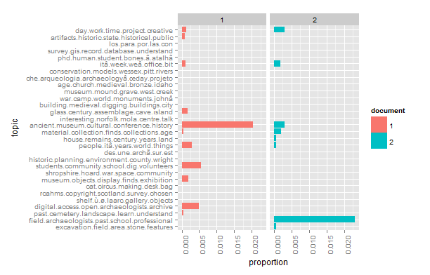
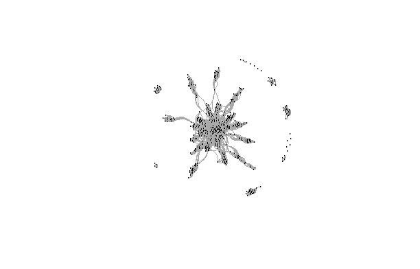

A Distant Reading of the Day of Archaeology
====

Introduction
----
The [Day of Archaeology](http://en.wikipedia.org/wiki/Day_of_Archaeology) is an event where archaeologists write about their acitivities on a [group blog](http://www.dayofarchaeology.com/). The event started in 2011 and aims to 'provide a window into the daily lives of archaeologists from all over the world'. Currently there are over 1000 posts on the blog, rather a lot to read in one sitting. Rather than closely read each post, we can do a distant reading to get some insights into the corpus. Distant reading is a term advocated by [Franco Moretti](http://en.wikipedia.org/wiki/Franco_Moretti) to refer to efforts to understand texts through quantitative analysis and visualisation. 

A quantitative method that has recently become [popular](http://mith.umd.edu/topic-modeling-in-the-humanities-an-overview/) for distant reading is [topic modelling](https://en.wikipedia.org/wiki/Topic_model/). To get some insights into what all these archaeologists were writing about, I've generated a topic model to find the most important themes amongst the posts. By browsing the topics I can see what they key ideas are withouth having to read every word of every post. This approach is inspired by Matt Jockers' [analysis of the 2010 Day of Digital Humanities blog posts](http://www.matthewjockers.net/2010/03/19/whos-your-dh-blog-mate-match-making-the-day-of-dh-bloggers-with-topic-modeling/), and Shawn Graham, who did a similar [analysis of the 2011 Day of Archaeology blog posts](http://electricarchaeology.ca/2012/07/09/mining-a-day-of-archaeology/) and has also written an [accessible introduction to topic modelling](http://programminghistorian.org/lessons/topic-modeling-and-mallet). 

The questions I'm attempting to answer with this distant reading include: what is in a typical day of an archaeologist? What are the different kinds of day that are represented in this collection? Do all archaeologists have generally similar days or not? As an archaeologist also I'm curious to see how my day compares with others!

Method
----
My method uses the [R](http://www.r-project.org/) programming language and a few external tools, most notably [MALLET](http://mallet.cs.umass.edu/). The method should be completely reproducible using the code in this repository (go ahead and try it! I recommend using R with [RStudio](http://www.rstudio.com/ide/download/)). Here's a quick summary of the process, do inspect the code for more details. 

First, I scraped the [dayofarchaeology.com](http://www.dayofarchaeology.com) site to get the links to the full text of each post (because the front and subsequent pages of the main site only give a snippet of text as a teaser). The [blog](http://www.dayofarchaeology.com) has a [Creative Commons Attribution-ShareAlike 3.0 License](http://creativecommons.org/licenses/by-sa/3.0/) which means we are free to copy, share and remix the blog contents, provided we give proper attribution (did I mention all of this is coming from [dayofarchaeology.com](http://www.dayofarchaeology.com)?) and make the results available with the same or similar licence (I use the [MIT licence](http://opensource.org/licenses/MIT) for this repository, which is similar). Second, I pulled the full text from each post, along with the name of the author and the date. Third, I cleaned the text to remove unusual characters and formatting. Fourth, I generated a topic model using the latent Dirchlet allocation algorithm implemented MALLET (it's much faster that the pure R methods). I arbitrarily set the number of topics at 30 and generated one model with all posts from 2012-2013. Fifth, I computed a similarity matrix for the authors of each post based on the mixture of topics in each author's post. Sixth, I computed a k-means cluster analysis to assign each author into a group, based on the topics detected in their post. Seventh, I visualised the groups of authors with a network graph. Each step of the method has a corresponding file in this repository. 

Results
----

I've put all the scraped data in a [csv file here](https://raw.github.com/benmarwick/dayofarchaeology/master/data/dayofarchaeology.csv) (right-click -> save link as...) in case you want to browse or do other analyses. The csv file contains the full text of each post, the name of the author, the date of publication and the URL of the post. 

#### Summary of the corpus

In the 2012-2013 corpus there are a total of 352,558 words in 622 blog posts by 370 unique authors (as of 5pm EST 28 July 2013, a few more posts trickled in after this time, but this analysis is a weekend project, so it stops on a Sunday evening). The author count is probably an underestimate as some posts ([like this very long one](http://www.dayofarchaeology.com/life-in-a-day-the-silchester-town-life-project/)) are written by multiple people using a common affliation as the author name. There were fewer posts in 2013 (n = 273) compared to 2012 (n = 348), but the average length of the posts is slightly higher in 2013 (mean = 591) compared to 2012 (mean = 549). Here's a plot of the distribution of words per post by year:

#### Summary of the topic model

Here are 50 key words for the 30 topics generated by the LDA model:

 [1] "excavation field area stone features ground excavations tools soil excavated test discovered campus feature involved surface high late story rock bone level dating pit pits areas natural source survey structures photo forms excavate excavating flint larger located deposits open fragments trowel clear difficult geophysical floor image entire buried filled allowed"                                                                                           
 [2] "field archaeologists past school professional interested ferry understanding favorite knowledge washington skills public farm individuals topic director communication screen interests responsibility profession experiences single popular article artifacts engage professionals macedonia academic real participation archeology band digs semester shows scientific future diversity enjoyed vcu unit sit civil pseudoarchaeology washingtonâ dig responsibilities"
 [3] "past cemetery landscape learn understand human questions interested modern interest ceramics lab early understanding water archaeologists places identify enjoy animal record techniques bones common simply methods personal southern types lost studying simple reason helps program ceramic lives lack collecting communities othe lived step properly inside kids property locations surveying question"                                                            
 [4] "digital access open archaeologists archive ads database online content reports director app text images center media free video system community linked library grey files visual literature metadata punk toronto scarf web order articles mobile videos create adding file mukurtu thousands cultural platform image publication dead filemaker databases edit asi created"                                                                                           
 [5] "shelf ù"ø laarc gallery objects ùsø archive number ù"ù center lottery ø«ø ù.ù cooper ù^ø ù.ø suggested orange object completely metal registered piece dayofarch ùsù environmental discover random store øªø border solid width tweet margin auto float margin-top text-align img cfcfcf margin-left ù"ù.ø weâ medieval excavated london message textile holdsâ"                                                                                                        
 [6] "rcahms copyright scotland survey chosen built aerial ordnance stone castle database crown favourite historic landscape north twitter photographs view scottish loch fort record park south east images west wall water buildings structures photograph place myarchaeology.â canmore recorded visit revealed remains monuments timber image people history island stones century cropmarks location"                                                                    
 [7] "cat circus making desk bag fort centre dig observatory urns click colchester house hat green cans uppsala unit system cremation contents high article mining ice common garden yellow editor utah cwa regular session magazine friend captains folkestone auckland hold renovation army avoid newsletter care drop warm military sardine taylorâ baseball"                                                                                                              
 [8] "museum objects display finds exhibition object museums coins treasure metal history antiquities coin silver database hoard scheme material social british casts case cases interested items detecting stolen classical looting tile temporary create gold market pas museumâ north hertfordshire gallery portable conservation finder looted hitchin preserved story cast stories pot vessel"                                                                           
 [9] "shropshire hoard war space community bristol royalist detectorists bitterley veterans military graffiti county indigenous civil shrewsbury march garrison northern south army territory communities ludlow contemporary earth parliamentarian wem paid country family worth spacecraft nter jawoyn club force aboriginal parliamentarians brampton similar system support significant messages men castle rights relic cavalry"                                         
[10] "students community school dig volunteers student children learning people archaeologists visitors experience past involved history open events undergraduate learn training education workshops skills typical schools questions town activity weeks learned outreach science friends planning educational silchester class tour workshop pottery college gave talks teaching participants placement aim tours teach contribute"                                        
[11] "historic planning environment county wright vitaemilia policy law council conservation ireland committee protection issues commercial dayofarch government means rescue potential dayofarchâ knowledge development board impact resources client records carried developer officers interest process buildings july works practice natural early national remains monitoring organisations sector officer sweden significance standards money organisation"             
[12] "des une archã sur est pour dans qui nous prã ologie avec par mon journã moyen fouille inrap gallery intã aux vous occupation cette diagnostic mãªme aussi donnã ont fait muller-pelletier sols ologues ologique lors exceptionnelle ces siã vie ils carine scientifique sont vestiges tre couverte viarmes chã large questions"                                                                                                                                         
[13] "people itâ years world things lot interesting reading read blog write means donâ posts book head fun point canâ didnâ list weeks fact ago career books share called degree ideas pieces position youâ kind stuff context theyâ thinking huge moving issues fit historical sitting resources person phd happened play talk"                                                                                                                                              
[14] "house remains century years land houses area gardens bones family middle small brown occupied called ancient bottom industrial lake fields conditions sample garden base andâ living council estate church child cut destruction remaining teeth town college salt thin britain sea point farm fine green trees shown deposit market reach chapel"                                                                                                                      
[15] "material collection finds collections age excavations records artefacts iron years early excavated record pottery small late boxes box range archives publication archive ago storage store documents drawings modern original individual colleague technology documentation created bronze assistant task extensive building published making researchers began remains hill photograph centre collected catalogue town"                                               
[16] "ancient museum cultural conference history social academic institute teaching writing australia dissertation living egypt city department society culture early museums focused western published funding web science european past human discipline mentioned egyptian southern sciences interested eastern tomb humanities trip associate fellowship oxford universities included relevant professor on-line places materials world"                                  
[17] "interesting norfolk mola centre talk programme colleague range wood visitor festival landscape dating assemblage building neolithic closely timbers lottery anglo-saxon species grave england services involved fund coastal cba hearth senior discussion review waterlogged flots bone identification reminded specialists scotland csi radiocarbon action thames manager artist crannog graves offer specialist biggest"                                              
[18] "glass century assemblage cave island leather early mosaic interesting weâ fragments white ireland nails shoe beautiful preserved discovery vessel wild norse end mountains opening covered bowl vessels bay galway shoes visible quarters piece common colleague degrees share flood imagine ale lion segni sides harbour men drawing french economic dublin roads"                                                                                                     
[19] "building medieval digging buildings city small trench finds crew construction excavating walls early dig hot built wall dug road lots street hole top urban inside weeks water brick library close heat town pottery fill samples deep food dates record pot block dark basement complex cleaning trenches experienced materials nearby pipe"                                                                                                                           
[20] "war camp world monuments johnâ british battle institute italy rome statue memorial evans faraday spain photos knossos italian malta command cambridge half fig bomber papers figures gave monument raf shells doa involvement spanish boat shamanic latin neolithic materials activity idea campaign crete negatives monticello pow tests japanese palatine copenhagen ioa"                                                                                             
[21] "museum mound grave west creek curator complex facility group making stones corn garden native tour display interpretive manchester days incised volunteers program gift room library consists culture museum.â slide documentary gcmac trays view flint burial film educational moundsville delf norona shop educator beads displays square visitors wonderful papers check care"                                                                                       
[22] "age church medieval bronze idaho iron palace ireland village early churches burials end burial farm national exmoor identified london coffin sandpoint post-medieval cist cremation land parish viking stepney close houses population peat valley happy green skeleton surrounded swca holy horse symbolic mola live mound spread boundary wooden moorland peterborough appaloosa"                                                                                     
[23] "che arqueologia archaeologyâ oday projeto dei montescudaio sambaqui progetto archeologia uma con modo delle allâ sono cubatã layer piã medievale montecorvino gli archeologi attraverso mio elementi pisa baldassarri post video cad museu prof sul virtual dellâ sia questo lavorare naturalmente essere disegno bassa material autocad base file vital joinville stico"                                                                                               
[24] "conservation models wessex pitt rivers lab model wiltshire south large salisbury figurines excavated wood service areas plaster scanning maritime damage space materials equipment operation condition wreck paint cleaned surface general shopping treatment remove conserving imaging diving skeleton cleaning protected corrosion aim underwater scale fragile nightingale gallery heavy camera wooden loose"                                                        
[25] "itâ week weâ office bit days morning writing started start things check process archaeologists spend thatâ recording lot full afternoon hours couple london pretty main short small end finished ready final finally call donâ half idea leave computer emails friday yesterday lunch current thereâ tea lots running youâ making finish"                                                                                                                               
[26] "phd human student bones ã???atalhã samples deer pottery bone turkey thesis worcester cake cardiff residues animal room neolithic collaboration difficult animals hut faunal close worcestershire jaffa jebel writing suggested slag pots hive fallow bronze favourite supportive materials huge hike peak isotope analysing smith published phds fellow changing activity laboratory researcher"                                                                          
[27] "survey gis record database understand aerial recording records laser maps wales photography photographic systems total world techniques form spatial film cross trees multiple tables english discussion hill processing leader landscapes valley involved software station scanner avon tree yorkshire field system relevant norwegian andâ fields medieval structure context generally computers entered"                                                             
[28] "los para por las con mã¡s arqueologã como arqueã day trabajo proyecto arqueolã desde este pero sobre expressly stated licensed creative commons attribution-sharealike unported license logos muy todo mallou histã nos hoy patrimonio ser ver hora tiempo tengo dayofarch entre historia asã tambiã madrid video dos grupo vez soy logo"                                                                                                                               
[29] "artifacts historic state historical public national park cultural arkansas lab history survey resources program african graduate philadelphia preservation pennsylvania unit states society native united artifact archeological county materials portion camp center property crm exhibit foundation bridge education century outreach findings station laboratory equipment curation assistant teach document americans preserve south"                               
[30] "day work time project creative licensed commons stated license expressly attribution-sharealike unported working today year heritage archaeologist find local team job projects life post important public spent large group including report place number fieldwork exciting staff visit set july future members provide colleagues hard based present worked plan management reports"

It should be pretty obvious that these topics are generated by a probabilistic algorithm rather than carefully organised by a person. For example, medieval churches and Idaho in topic 22 and the cat circus in topic 7 are rather dissonant combinations. However, many of the topics seem quite distinctive and coherent, such as 4, 6, and 20. A few topics seem to make sense as mixtures or [chimera topics](http://journalofdigitalhumanities.org/2-1/words-alone-by-benjamin-m-schmidt/), suggesting that a slightly higher number of topics might be more appropriate. Topic 25 is like an eerily garbled telegraphic text message from an unfortunate archaeologist chained to a desk (and is similar to Graham's [topic 17](http://graeworks.net/topic-model/doa2012/Topics/Topic17.html) from 2012). Topics 28 and 30 are colophon topics dominated by the license that is attached to each post. With additional effort and time, such as analysing topic diagnostics and excluding more stopwords and non-noun parts of speech we may be able to refine the topic model. 

#### Basic validation of the model

We can validate the model to a basic degree by closely reading a tiny random sample of the corpus to see if the model's classifications seem accurate. For example, here we can see the mixture of topics in the posts by my friend and colleague [Jacq Matthews](http://www.dayofarchaeology.com/author/jacquelinematthews/):

That seems pretty good, Jacq's 2012 post was about field work and her duties as an officer of the Australian Archaeological Association, while her 2013 post is more about social sciences and global cultural heritage.

And here's a graph of an interesting post by Ryan Baker on [using small aerial drones for archaeological photography, survey and model-making](http://www.dayofarchaeology.com/aerial-survey-of-archaeological-excavations-using-quad-rotor-and-hex-rotor-aircraft-arch-aerial/):

A good classification, with high proportions of topic 24 that includes models, camera, figurines and equipment and topic 27 with survey, GIS and photography.

And here we can see that [Sarah Bennett](http://www.dayofarchaeology.com/author/bennetts/), an archaeologist in Florida, made quite different posts in each year:

Sarah's 2013 post is about volunteers cleaning up a historic cemetery, which is nicely captured by topic 3. Topic 29 reflects the public volunteer aspect of the post. Sarah's 2012 post is about the excavation of a shell midden, clearly indicated by a high proportions of topic 1 and 20. Topic 20 is interesting because it seems mostly to be about the archaeology of war. We see 'shell' and 'shells' in topic 20 between the algorithm hasn't been able to distiguish between shells you eat and other kinds of shells (bombs, wrecked buildings, etc.). 

While the topic model has a few comical and naive moments, my informal and brief validation indicates that it is clearly not complete nonsense and is credible as a representation of the corpus. 

#### Visualisation of similar topics

To get a sense of relationships amongst the topics we can visualize a hierarchical clustering of topics. Here we can see that the museum topics tend to form a group distinct from the others. Excavation and field archaeology form a high-level cluster as well as regional historical archaeology topics (on the far right). The majority of topics are quite similar to each other.

#### Comparison of topics in 2012 and 2013

We can get an impression of the shift in topics from 2012 to 2013 by comparing the average proportions of each topic across all documents for each year. The five topics that are the most different are 12, 28, 6, 18 and 23. Topics 12, 23 and 28 are non-English language topics, suggesting are greater international contribution in 2013. Topic 6 seems to reflect the large number of posts in 2013 by or about archaeologists working with the Royal Commission on the Ancient and Historical Monuments of Scotland.

#### Groups of similar authors

Now that we've established the credibility of the topic model, we can look at how authors group together according to the mixtures of topics in their posts. Here are the groups of authors I get after a k-means analysis on topic proportions. I arbitrarily set the number of groups at 30 (you can run the code yourself and change the number to see what happens). With additional effort we could [algorithmically determine the optimum number of groups](http://stackoverflow.com/questions/15376075/cluster-analysis-in-r-determine-the-optimal-number-of-clusters/15376462#15376462). If there is a number after the name it's because that author has more than one post on the blog. Reassuringly, most of the time we see multiple posts by the same author in the same cluster. Although we saw above that it's not always the case that one author writes about the same general mix of topics in their posts. 

[[1]]
 [1] "sarah_may1"          "Claire Bradshaw"     "MOLA.1"             
 [4] "MOLA.6"              "David Gurney.3"      "MOLA.8"             
 [7] "bajrjobs.4"          "EHZooarchaeologists" "Susan Greaney.1"    
[10] "Karen Stewart"      

[[2]]
 [1] "Laracuente"                 "Declan Moore (Moore Group)"
 [3] "Emily Wright"               "Kelly Powell"              
 [5] "JamesAlbone"                "David Gurney"              
 [7] "Helen Wells"                "Ian Richardson"            
 [9] "Paul McCulloch"             "MOLA.5"                    
[11] "David Gurney.2"             "Dan Hull"                  
[13] "ChrisCumberpatch"           "Charles Mount"             
[15] "sylvia.warman"              "Laura Belton"              
[17] "Robin Standring"            "Michelle Touton"           
[19] "Emily Wright.1"             "Chris Constable.1"         
[21] "Giles Carey"                "Roman Baths Museum.1"      
[23] "Manda Forster"              "Magnus Reuterdahl.1"       

[[3]]
 [1] "Stephen Kay"         "Caroline Goodson"    "Alexandra Knox"     
 [4] "dberryman"           "Valentina"           "MOLA.7"             
 [7] "MOLA.9"              "michigan"            "Zsolt Magyar"       
[10] "Marcel Cornellissen" "dberryman.1"         "rrohe"              
[13] "talia_shay.1"        "MOLA.15"             "MOLA.20"            
[16] "MOLA.23"             "tuzusai2012"         "cornelius.1"        
[19] "tuzusai2012.1"      

[[4]]
[1] "cartvol.3" "MOLA.10"   "cartvol.7" "MOLA.14"   "cartvol.8"

[[5]]
 [1] "Alan Simkins"                                  
 [2] "RCAHMS.2"                                      
 [3] "gabe"                                          
 [4] "SUrachi.1"                                     
 [5] "PalatineEastPotteryProject.1"                  
 [6] "Francesco Ripanti"                             
 [7] "David Gurney.4"                                
 [8] "Amesemi"                                       
 [9] "Italian National Association of Archaeologists"
[10] "edlyne"                                        
[11] "AMTTA"                                         
[12] "ffion"                                         
[13] "The Gabii Project"                             
[14] "Stefano Costa.1"                               
[15] "William Hafford"                               
[16] "brennawalks"                                   
[17] "David Gill"                                    
[18] "lofttroll"                                     
[19] "Henriette Roued-Cunliffe.2"                    
[20] "Bob Muckle.2"                                  

[[6]]
 [1] "carmean"              "Rachael Sparks"       "Heather Sebire"      
 [4] "Amanda Brooks"        "Heather Cline"        "sdhaddow"            
 [7] "Manchester Museum"    "Steve Compston"       "Martin Lominy"       
[10] "mcarra"               "David E. Rotenizer.1" "Dena Sedar"          
[13] "Heather Cline.1"      "NGO Archaeologica.2"  "Andrew Kirkland"     
[16] "Amanda Brooks.1"     

[[7]]
 [1] "Susan Greaney"                      "Bolton Library and Museum Services"
 [3] "Sarah JaneHarknett.1"               "Shawn Graham.1"                    
 [5] "Laura Burnett"                      "William Hafford.1"                 
 [7] "Craig Barker"                       "Julie Cassidy"                     
 [9] "Laura Burnett.2"                    "Candace Richards"                  

[[8]]
[1] "cristiana"             "cristiana.1"           "Jaime Almansa Sánchez"
[4] "Khawla Goussous"       "cartvol.4"             "archscotland"         
[7] "Cara Jones"            "Lorna Richardson.4"    "archscotland.1"       

[[9]]
 [1] "Kevin Wooldridge"                 "David Standing"                  
 [3] "Jonathan Haller"                  "Kayt Armstrong"                  
 [5] "clydeandavon"                     "clydeandavon.1"                  
 [7] "RCAHMS.12"                        "Spencer Gavin Smith.1"           
 [9] "Chiz Harward (Urban Archaeology)" "Jenny Ryder"                     
[11] "RCAHMS.24"                        "Rosalind Buck"                   
[13] "Cathy Dagg"                       "MOLA.11"                         
[15] "Chris Green"                      "Aerial-Cam"                      
[17] "ArcheoWebby.1"                    "popefinn"                        
[19] "Paul"                             "Tom Goskar"                      
[21] "Serra Head.1"                     "Andrew Mayfield.1"               
[23] "Giles Carey.1"                    "Spencer Gavin Smith.2"           

[[10]]
 [1] "Lorna Richardson"   "ArcheoWebby"        "Sophie Hay"        
 [4] "saraperry"          "David Howell"       "Kayt Armstrong.1"  
 [7] "Susan Johnston"     "Don Henson"         "Francesca Tronchin"
[10] "Don Henson.2"       "MOLA.25"            "Kristina Killgrove"

[[11]]
 [1] "Brian Kerr"            "bajrjobs"              "MOLA"                 
 [4] "Dawn McLaren"          "Somayyeh Mottaghi"     "Lorna Richardson.1"   
 [7] "Dana Goodburn-Brown"   "James Morris"          "Dana Goodburn-Brown.2"
[10] "Mike Heyworth"         "Anne Crone"           

[[12]]
 [1] "sclements"               "Cath Poucher"            "cartvol.2"              
 [4] "Carole Bancroft-Turner"  "Megan Rowland"           "Jaime Almansa Sánchez.5"
 [7] "Guy Hunt.1"              "judgec"                  "Don Henson.1"           
[10] "judgec.1"                "Sarah MacLean"          

[[13]]
 [1] "Chris Constable"     "Guy Hunt"            "Spencer Gavin Smith"
 [4] "Helen Williams"      "Alice Kershaw"       "Rena MacGuire"      
 [7] "Rachel Ives.2"       "MOLA.18"             "Claire Woodhead.5"  
[10] "nikolah"             "Claire Woodhead.6"   "De Kogge"           

[[14]]
 [1] "RCAHMS"     "RCAHMS.1"   "RCAHMS.3"   "RCAHMS.4"   "RCAHMS.5"   "RCAHMS.6"  
 [7] "RCAHMS.7"   "RCAHMS.8"   "RCAHMS.9"   "RCAHMS.11"  "RCAHMS.13"  "RCAHMS.14" 
[13] "RCAHMS.15"  "RCAHMS.17"  "RCAHMS.18"  "RCAHMS.19"  "RCAHMS.20"  "RCAHMS.21" 
[19] "RCAHMS.22"  "RCAHMS.23"  "RCAHMS.25"  "RCAHMS.27"  "RCAHMS.28"  "RCAHMS.30" 
[25] "RCAHMS.31"  "RCAHMS.32"  "RCAHMS.33"  "Garry Law"  "James Cole" "RCAHMS.34" 
[31] "RCAHMS.36"  "RCAHMS.38"  "RCAHMS.39"  "RCAHMS.41"  "RCAHMS.43" 

[[15]]
[1] "archaeologicalresearchcollective" "Tamira"                          
[3] "cartvol.6"                       

[[16]]
[1] "Sandra LozanoRubio"   "Rmadgwick"            "Sandra LozanoRubio.1"
[4] "Tim Young"            "Scott Haddow"        

[[17]]
 [1] "Ralph Mills"           "cartvol"               "cartvol.1"            
 [4] "mmrathgaber"           "MOLA.3"                "brennawalks@gmail.com"
 [7] "MOLA.12"               "Lynn Evans"            "Matt Law.3"           
[10] "Dave Wilton"           "april.beisaw"          "IUSB PAFS"            
[13] "MOLA.17"               "Claire Woodhead.4"     "MOLA.22"              
[16] "RCAHMS.37"             "Sue Carter"            "Lynn Evans.1"         
[19] "Sue Carter.1"          "Colleen Morgan"       

[[18]]
 [1] "Molly Swords"              "MOLA.2"                   
 [3] "RCAHMS.16"                 "Laura Puolamaki"          
 [5] "Exmoorhistoricenvironment" "Molly Swords.1"           
 [7] "Mary Petrich-Guy"          "Dot Boughton"             
 [9] "Asa M Larsson"             "Rachel Ives"              

[[19]]
  [1] "Waveney ValleyCommunityArchaeologyGroup"                                               
  [2] "Glynis Irwin"                                                                          
  [3] "David E. Rotenizer"                                                                    
  [4] "rbakerarae"                                                                            
  [5] "Keneiloe Molopyane"                                                                    
  [6] "Beth Pruitt"                                                                           
  [7] "Grace Krause"                                                                          
  [8] "Gail Boyle"                                                                            
  [9] "Sarah Bennett"                                                                         
 [10] "Thiago Fossile"                                                                        
 [11] "Peter Reavill"                                                                         
 [12] "Scott Clark"                                                                           
 [13] "Lancaster Williams"                                                                    
 [14] "Jaime Almansa Sánchez.1"                                                               
 [15] "Jaime Almansa Sánchez.2"                                                               
 [16] "David Garcia Casas"                                                                    
 [17] "Christine Morris"                                                                      
 [18] ""                                                                                      
 [19] "Magnus Reuterdahl"                                                                     
 [20] "April Beisaw"                                                                          
 [21] "Tricia Jarratt"                                                                        
 [22] "Anthroprobably"                                                                        
 [23] "diacarco"                                                                              
 [24] "EAAPP"                                                                                 
 [25] "Pedro MoyaMaleno"                                                                      
 [26] "RCAHMS.10"                                                                             
 [27] "Jaime Almansa Sánchez.3"                                                               
 [28] "Briana Pobiner"                                                                        
 [29] "jbarnes9"                                                                              
 [30] "David Gurney.1"                                                                        
 [31] "Helen Keremedjiev"                                                                     
 [32] "Bernard K. Means"                                                                      
 [33] "Kelly Abbott"                                                                          
 [34] "Charlotte Douglas"                                                                     
 [35] "Manchester Museum.1"                                                                   
 [36] "Adam Corsini.2"                                                                        
 [37] "Kelly Abbott.1"                                                                        
 [38] "INRAP"                                                                                 
 [39] "INRAP.1"                                                                               
 [40] "drspacejunk"                                                                           
 [41] "angela middleton"                                                                      
 [42] "Sebastian Foxley"                                                                      
 [43] "Kelly Abbott.2"                                                                        
 [44] "Kelly Abbott.3"                                                                        
 [45] "Claire Woodhead.2"                                                                     
 [46] "INRAP.2"                                                                               
 [47] "Michelle Zupan"                                                                        
 [48] "magago"                                                                                
 [49] "RCAHMS.26"                                                                             
 [50] "Jaime Almansa Sánchez.4"                                                               
 [51] "RCAHMS.29"                                                                             
 [52] "Giuliano De Felice"                                                                    
 [53] "ArchaeoAD"                                                                             
 [54] "Becky Wragg Sykes"                                                                     
 [55] "Daniel Pett"                                                                           
 [56] "Lorna Richardson.2"                                                                    
 [57] "Lorna Richardson.3"                                                                    
 [58] "Lorna Richardson.5"                                                                    
 [59] "Lorna Richardson.6"                                                                    
 [60] "Lorna Richardson.7"                                                                    
 [61] "Lorna Richardson.8"                                                                    
 [62] "Todd Whitelaw"                                                                         
 [63] "Valentina.1"                                                                           
 [64] "Simone82"                                                                              
 [65] "Andrea"                                                                                
 [66] "Elizabeth Moore"                                                                       
 [67] "Anabelle Castaño"                                                                      
 [68] "Wessex Archaeology"                                                                    
 [69] "Wessex Archaeology.1"                                                                  
 [70] "Wessex Archaeology.2"                                                                  
 [71] "Wessex Archaeology.3"                                                                  
 [72] "AngelGreen"                                                                            
 [73] "Laracuente.1"                                                                          
 [74] "Christina O'Regan"                                                                     
 [75] "Italian National Association of Archaeologists.1"                                      
 [76] "Janet Jones"                                                                           
 [77] "Henriette Roued-Cunliffe"                                                              
 [78] "Sheena Payne-Lunn"                                                                     
 [79] "Project Florence"                                                                      
 [80] "Monrepos - Archaeological Research Centre and Museum for Human Behavioural Evolution.1"
 [81] "MOLA.13"                                                                               
 [82] "Beverly Chiarulli"                                                                     
 [83] "Richard O'Brien"                                                                       
 [84] "Evaristo Gestoso Rodriguez"                                                            
 [85] "AMTTA.1"                                                                               
 [86] "Margie"                                                                                
 [87] "Sarah Bennett.1"                                                                       
 [88] "duncans"                                                                               
 [89] "John Worth"                                                                            
 [90] "Dana Goodburn-Brown.3"                                                                 
 [91] "Beth Pruitt.1"                                                                         
 [92] "NGO Archaeologica"                                                                     
 [93] "Philadelphia Archaeological Forum.3"                                                   
 [94] "Ashley McCuistion"                                                                     
 [95] "Marni Walter.1"                                                                        
 [96] "AVenovcevs"                                                                            
 [97] "AKOT Heritage"                                                                         
 [98] "nashcl"                                                                                
 [99] "michigan.1"                                                                            
[100] "David Standing.1"                                                                      
[101] "Robin Standring.1"                                                                     
[102] "Laura Griffin"                                                                         
[103] "John Worth.1"                                                                          
[104] "Bernard K. Means.1"                                                                    
[105] "Ian Richardson.1"                                                                      
[106] "aeadams83"                                                                             
[107] "cornelius"                                                                             
[108] "NGO Archaeologica.1"                                                                   
[109] "David Howell.1"                                                                        
[110] "hinesbuwf"                                                                             
[111] "eharchaeology"                                                                         
[112] "Damian Shiels"                                                                         
[113] "Peter Reavill.1"                                                                       
[114] "Peter Reavill.2"                                                                       
[115] "MOLA.16"                                                                               
[116] "Peter Reavill.3"                                                                       
[117] "Rachel Ives.1"                                                                         
[118] "Sophie Hay.1"                                                                          
[119] "Thomas Loebel"                                                                         
[120] "María José Figuerero"                                                                  
[121] "Carmen Ting"                                                                           
[122] "Peter Reavill.4"                                                                       
[123] "RCAHMS.35"                                                                             
[124] "MOLA.19"                                                                               
[125] "transit_monkey"                                                                        
[126] "ralphj"                                                                                
[127] "Peter Reavill.5"                                                                       
[128] "Emily Noel-Paton"                                                                      
[129] "Peter Reavill.6"                                                                       
[130] "Tim Young.1"                                                                           
[131] "Declan Moore (Moore Group).1"                                                          
[132] "Liz Goodman"                                                                           
[133] "Gaye Nayton"                                                                           
[134] "John Worth.2"                                                                          
[135] "MOLA.24"                                                                               
[136] "alinelara"                                                                             
[137] "Claire Woodhead.7"                                                                     
[138] "RCAHMS.40"                                                                             
[139] "Peter Reavill.8"                                                                       
[140] "Cathy Dagg.1"                                                                          
[141] "Helen Williams.1"                                                                      
[142] "Charles Mount.1"                                                                       
[143] "murosv"                                                                                
[144] "Ferry"                                                                                 
[145] "Grace Krause.1"                                                                        
[146] "hinesbuwf.1"                                                                           
[147] "David Hunter"                                                                          
[148] "Peter Reavill.9"                                                                       

[[20]]
 [1] "Matt Law"               "alexism"                "SUrachi"               
 [4] "Rob Hedge"              "Claire Woodhead"        "Matt Law.1"            
 [7] "Rebecca"                "castlesandcoprolites"   "Matt Law.2"            
[10] "Dana Goodburn-Brown.1"  "Melonie Shier"          "David Osborne"         
[13] "eastoxford"             "DeborahFox"             "Liza Kavanagh"         
[16] "Joe Flatman"            "Pat Hadley"             "long1086"              
[19] "Hembo Pagi"             "Stu Eve"                "Andy Dufton"           
[22] "Sara Perry"             "Allison Mickel"         "Richard Madgwick"      
[25] "Alice Forward"          "Jacqui Mulville"        "castlesandcoprolites.1"
[28] "Don Henson.3"          

[[21]]
 [1] "CAT"                                                                                 
 [2] "CoDA_ucb.3"                                                                          
 [3] "bajrjobs.1"                                                                          
 [4] "Carly Hilts, Current Archaeology/Current World Archaeology"                          
 [5] "Samantha Brown"                                                                      
 [6] "bajrjobs.2"                                                                          
 [7] "bajrjobs.3"                                                                          
 [8] "Annie Partridge"                                                                     
 [9] "F.R.A.G."                                                                            
[10] "Christopher Merritt"                                                                 
[11] "Monrepos - Archaeological Research Centre and Museum for Human Behavioural Evolution"
[12] "Anne Jensen"                                                                         
[13] "Xtinebean"                                                                           
[14] "Nancy Grace"                                                                         
[15] "Carl Carlson-Drexler"                                                                
[16] "Matthew Jones"                                                                       
[17] "Carly Hilts, Current Archaeology/Current World Archaeology.1"                        
[18] "Terry Brock"                                                                         
[19] "MOLA.21"                                                                             
[20] "Robyn Antanovskii"                                                                   
[21] "izoken"                                                                              
[22] "Geoff Wyatt"                                                                         

[[22]]
 [1] "Darlene Applegate"                   "Sean Naleimaile"                    
 [3] "Mandy Ranslow"                       "Jamie Chad Brandon"                 
 [5] "John Lowe"                           "cdrexler"                           
 [7] "Nicole Bucchino"                     "Sean Naleimaile.1"                  
 [9] "cames"                               "Claire vanNierop"                   
[11] "gwynn henderson"                     "Glynis Irwin.1"                     
[13] "Philadelphia Archaeological Forum"   "Philadelphia Archaeological Forum.1"
[15] "Philadelphia Archaeological Forum.2" "Philadelphia Archaeological Forum.4"
[17] "John Lowe.1"                         "Mandy Ranslow.1"                    
[19] "Kurt Thomas Hunt"                    "Valerie M. J. Hall"                 
[21] "Rebecca Duggan"                      "Lucy Johnson"                       
[23] "Jamie Chad Brandon.1"               

[[23]]
 [1] "SuccinctBill"           "Doug"                   "CoDA_ucb"              
 [4] "Russell Alleen-Willems" "Shawn Graham"           "CoDA_ucb.1"            
 [7] "Leigh Anne"             "CoDA_ucb.2"             "CoDA_ucb.4"            
[10] "Beatrice Hopkinson"     "CoDA_ucb.5"             "Neil Gevaux"           
[13] "APAAME"                 "Andrew Reinhard"        "Ray Moore"             
[16] "cejo"                   "Doug.1"                 "Ulla Rajala"           
[19] "Eric Kansa"             "Shawn Graham.2"         "emmajaneoriordan"      
[22] "ADS"                    "Ethan Watrall"          "Andrew Reinhard.1"     
[25] "Kasia"                  "emmajaneoriordan.1"     "Kasia.1"               

[[24]]
 [1] "Francis Deblauwe"           "Jacq Matthews"             
 [3] "Kathryn E. Piquette"        "Bob Muckle"                
 [5] "Mark Patton"                "johnwillimas"              
 [7] "SuzieThomas"                "cristiana.2"               
 [9] "Kelly M"                    "Becky Wragg Sykes.1"       
[11] "Alex Nagel"                 "Udjahorresnet"             
[13] "Kathryn E. Piquette.1"      "Diefenerfer.1"             
[15] "Nancy Lovell"               "bupap"                     
[17] "terhi"                      "Henriette Roued-Cunliffe.1"
[19] "Axel G. Posluschny"         "Bob Muckle.1"              
[21] "ArchaeoAD.1"                "Melanie Pitkin"            

[[25]]
 [1] "Adam Corsini"        "Adam Corsini.1"      "Adam Corsini.3"     
 [4] "Adam Corsini.4"      "Adam Corsini.5"      "Marcel Dallinger"   
 [7] "Pippa Pearce"        "CooperCenter"        "Andrew Fetherston"  
[10] "Lucy Sawyer"         "Andrew Fetherston.1" "CooperCenter.1"     
[13] "Andrew Fetherston.2" "Andrew Fetherston.3" "fieldwork"          
[16] "Andrew Fetherston.4" "Andrew Fetherston.5"

[[26]]
 [1] "Diefenerfer"                "Angela Piccini"            
 [3] "Serra Head"                 "Ryan Swanson"              
 [5] "PalatineEastPotteryProject" "magago.1"                  
 [7] "Mathias Probst"             "Jacq Matthews.1"           
 [9] "Tanya Peres Lemons"         "cartvol.5"                 
[11] "Lorna Richardson.10"        "FlindersArchSoc"           
[13] "tkriek"                     "Polly Peterson"            
[15] "Vasilka Dimitrovska"       

[[27]]
 [1] "DavidAltoft"               "ssprince"                 
 [3] "Bairbre Mullee"            "Cayla Breiling"           
 [5] "Sally Rodgers"             "Sarah JaneHarknett"       
 [7] "Claire Woodhead.1"         "Alex Moseley"             
 [9] "Samantha Colclough"        "Amanda Clarke"            
[11] "talia_shay"                "Marni Walter"             
[13] "Archaeology UFPI - BRAZIL" "Cara Jones.1"             
[15] "sarah_may1.1"              "Charlotte Douglas.1"      
[17] "Bairbre Mullee.1"          "Samantha Barnes"          
[19] "Hayley Forsyth"            "Brian"                    
[21] "Joanne Robinson"           "LizzieW"                  
[23] "bthorn"                    "Mike Pitts"               
[25] "Andrew Mayfield"           "Andrew Mayfield.2"        
[27] "Brian.1"                  

[[28]]
 [1] "Alfred W. Bowers Laboratory of Anthropology"
 [2] "Stefano Costa"                              
 [3] "Penny Johnston"                             
 [4] "Frank Lynam"                                
 [5] "MOLA.4"                                     
 [6] "Lorna Richardson.9"                         
 [7] "Helen Sharp"                                
 [8] "FALSE"                                      
 [9] "Rachael Sparks.1"                           
[10] "Claire Woodhead.3"                          
[11] "Roman Baths Museum"                         
[12] "sven"                                       
[13] "Dawn McLaren.1"                             
[14] "RCAHMS.42"                                  

[[29]]
 [1] "Bob Clarke"                         "Chiz Harward (Urban Archaeology).1"
 [3] "Katy Meyers"                        "Rose"                              
 [5] "mwilliams"                          "Nicola Hembrey"                    
 [7] "Helen Goodchild"                    "Sue Harrington"                    
 [9] "Kasia.2"                            "jpalmer"                           
[11] "Stefan Sagrott"                    

[[30]]
 [1] "SusanneT"                     "adamrabinowitz"              
 [3] "Donna Yates"                  "Eleanor Ghey"                
 [5] "Keith Fitzpatrick-Matthews"   "phdiva"                      
 [7] "Keith Fitzpatrick-Matthews.1" "Laura Burnett.1"             
 [9] "Charlotte Dixon"              "Peter Reavill.7"             
[11] "Keith Fitzpatrick-Matthews.2" "Wendy Scott"                 
              
#### Visualisation of author groups

Here is a static visualisation of the relationship between all the authors. We get a quick sense that there are distinctive groups, but it's too small to show author names which is a major limitation.

Here is a [slightly interactive visualisation](http://htmlpreview.github.io/?https://github.com/benmarwick/dayofarchaeology/master/figures/d3net.html), where we can see names on the nodes (click on them to magnify the name) and inspect them in more detail by dragging them around. 

An even more interactive version can be downloaded [here](https://raw.github.com/benmarwick/dayofarchaeology/master/figures/g.graphml) (right-click -> save link as...) and opened in [Gephi](https://gephi.org/). 

Discussion and Conclusion
----

